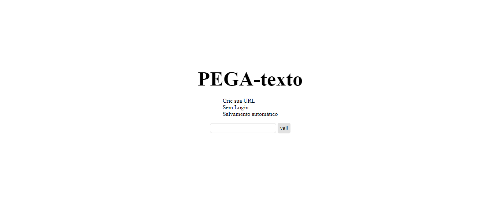

<h1 align="center">PEGA-texto 📖</h1>

<p align="center">📝 Projeto em NodeJS que funciona como um editor de texto online, geralmente útil para estudantes que costumam compartilharem conteúdos (códigos? atividades? trabalhos? colas?) entre si</p>

<h4 align="center">🚧 Projeto ainda em construção, necessário corrigir funcionamento do web socket (não está 100% como deveria)🚧</h4>
<h4> </h4>

### 💻 Tecnologias
Principais dependências utilizadas:
- [Node.js](https://nodejs.org/en/)
- [Express](https://expressjs.com/en/api.html)
- [Socket.io](https://socket.io/pt-br/docs/v4/)

### Rotas
- requisição GET em '/': 
    * renderiza a página inicial
- requisição POST em '/':
    * Após preenchimento do único campo da tela inicial acontece redireciomanento para a URL definida na barra de input
- requisição GET em '/qualquer_url':
    * URL dinâmica, acontece redirecionamento para a rota /qualquer_url independente de ser existente ou não
    * Cada URL possui seu próprio conteúdo
    * O conteúdo é salvo automaticamente após 3 segundos da inserção do último caractere.
    * Qualquer pessoa pode alterar o conteúdo de qualquer rota
    * Alterações possíveis de perceber em tempo real (socket.io)
    * Para todas as rotas dinâmicas é contado a quantidade de vezes que foi acessada

<h1 align="center">
  
</h1>

### Requisitos:
Necessário ter Git e Node instalado  


### ⌨️ Rodando o servidor:
```bash
# Clone este repositório
$ git clone https://github.com/reidn3r/pega-texto

# Acesse a pasta do projeto no terminal/cmd
$ cd pega-texto

# Instale as dependências
$ npm install

# Execute a aplicação em modo de desenvolvimento
$ npm run dev
